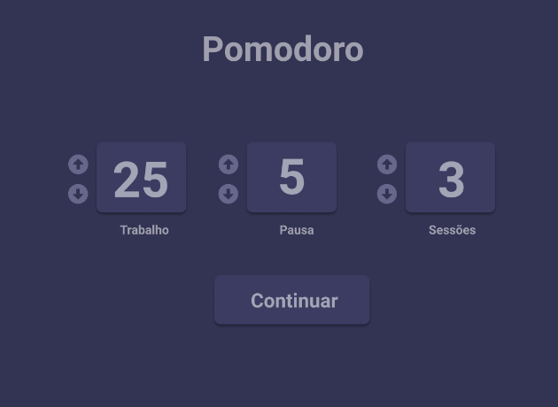
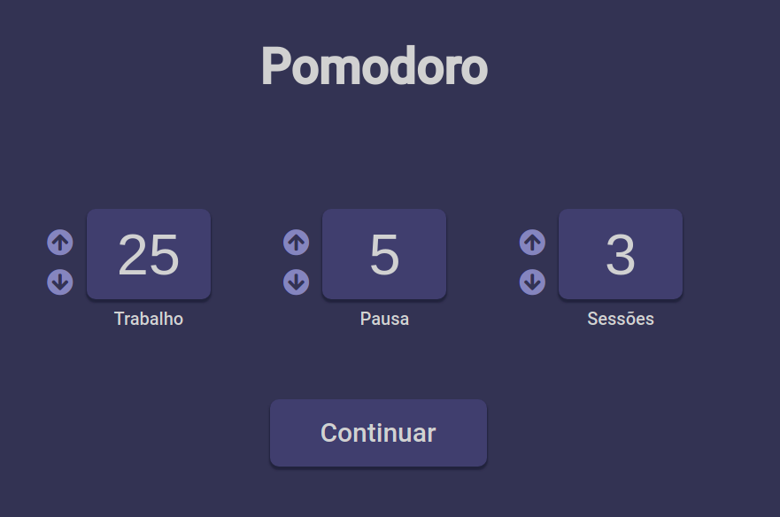
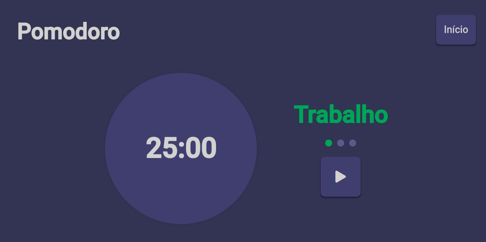

## Para visualizar o site: https://godinhojoao.github.io/pomodoro/

<table>
  <tr>
    <th>Desafio</th>
    <th>Resultado</th>
  </tr>
  <tr>
    <td>
      
    </td>
    <td>
      
    </td>
  </tr>
</table>

<table>
  <tr>
    <th>Desafio</th>
    <th>Resultado</th>
  </tr>
  <tr>
    <td>
      
    </td>
    <td>
      
    </td>
  </tr>
</table>

# Sobre o site

- A ideia para criar este site é de um desafio de um repositório no github, link do repositório: https://github.com/devchallenge-io/pomodoro
- O site é basicamente um cronômetro que utiliza a técnica do pomodoro para ajudar na gestão de tempo.

# Para rodar o projeto na sua máquina:

- git clone https://github.com/godinhojoao/pomodoro
- Instale o node em: https://nodejs.org/en/
- npm install (no seu terminal para baixar as dependencias do projeto)
- npm start (para rodar o projeto)
